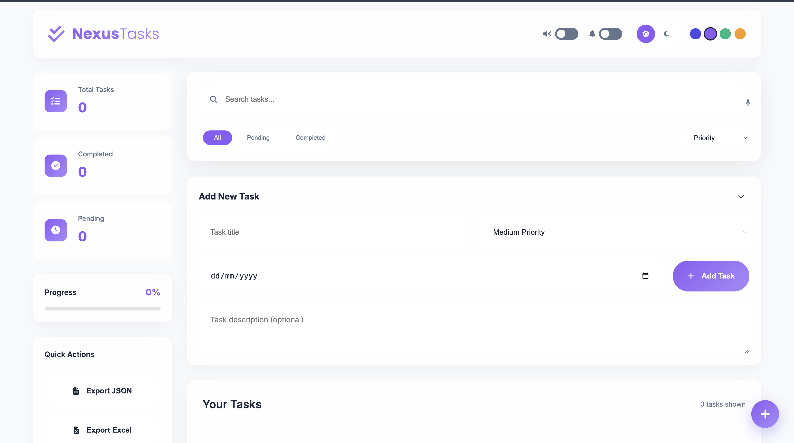
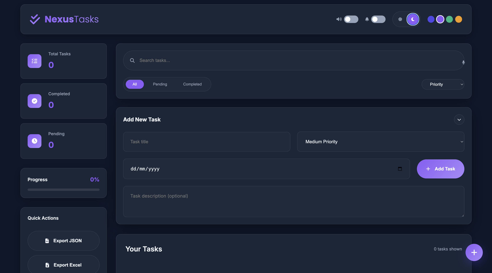
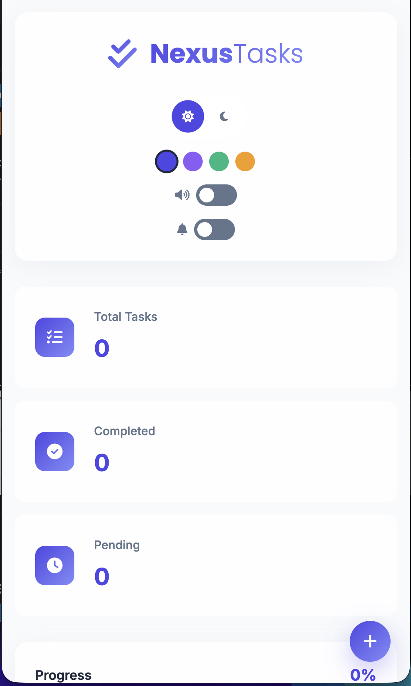

# 📝 NexusTasks – Modern To-Do List Application  

A beautiful, feature-rich to-do list application with a **glassmorphism UI**, **dark mode**, and **Excel/JSON/CSV export** capabilities. Built entirely with **vanilla HTML, CSS, and JavaScript** — no frameworks, no dependencies.

---

## 🌟 Live Demo  
🔗 **Live Demo:** [https://wazehfarhan.github.io/to-do-webVersion/](https://wazehfarhan.github.io/to-do-webVersion/)

---

## 📸 Preview  

| Light Mode | Dark Mode | Mobile View |
|-----------|-----------|-------------|
|  |  |  |

---

# 🚀 Features

## 🎨 UI/UX Experience  
- Glassmorphism modern design  
- Dark/Light mode toggle  
- Custom accent colors  
- Fully responsive UI  
- Smooth animations  
- Animated checkboxes with optional sound effects  

## ✅ Core To-Do Features  
- Add tasks (title, priority, due date, description)  
- Edit tasks  
- Delete tasks (with confirmation + undo)  
- Mark as completed  
- Priority levels (High/Medium/Low)  
- Due-date detection (overdue highlight)  
- Detailed descriptions  

## 🔍 Productivity Tools  
- Filter (All, Completed, Pending)  
- Sorting (Priority, Date, Due Date, Alphabetical)  
- Real-time search  
- Voice search (Web Speech API)  
- Drag & drop reordering  
- Weekly calendar view  
- Progress tracking  

## 📊 Data Management  
- Excel Export/Import (.xlsx)  
- JSON Export/Import  
- CSV Export  
- LocalStorage persistence  
- Storage usage monitor  

## 🔔 Advanced Features  
- Daily notifications  
- Optional UI sound effects  
- Keyboard shortcuts  
- Calendar integration  
- Multiple export formats  

---

# 🛠️ Technology Stack  
- HTML5  
- CSS3 (Variables, Glassmorphism, Flexbox, Grid)  
- JavaScript ES6+  
- LocalStorage API  
- Web Notification API  
- Web Speech API  
- SheetJS (xlsx)  

---

# 📁 Project Structure  

nexus-tasks/  
│  
├── index.html – Main UI layout  
├── style.css – Glassmorphism + Dark/Light theme styling  
├── app.js – Core application logic  
├── README.md – Documentation    

---

# 🚀 Quick Start

### Option 1: Download ZIP
1. Download the repository  
2. Extract the folder  
3. Open `index.html` in your browser  

### Option 2: Clone Repository
1. Open terminal  
2. Run: `git clone https://github.com/wazehfarhan/to-do-webVersion.git`  
3. `cd to-do-webVersion`  
4. Open `index.html` in your browser  

### Option 3: Deploy
- GitHub Pages  
- Netlify  
- Vercel  
- Any static hosting  

---

# 📖 Usage Guide

## Adding Tasks
- Type your task  
- Set priority (optional)  
- Add due date (optional)  
- Add description (optional)  
- Press Enter or click Add Task  

## Managing Tasks
- Complete: ✅  
- Edit: ✏️  
- Delete: 🗑️  
- View details: 🔍  
- Reorder: drag & drop  

## Filters & Sorting
- Filter: All/Completed/Pending  
- Sort by priority/date/alphabet  
- Search instantly  
- Voice search  

## Customization
- Light/Dark mode toggle  
- Accent color options  
- Enable/disable sound effects  
- Notifications  

## Export/Import Data
- Export: JSON / Excel / CSV  
- Import: JSON / Excel (merges tasks into list)  

---

# ⌨️ Keyboard Shortcuts  

| Shortcut | Action |  
|---------|--------|  
| Ctrl/Cmd + N | Focus new task input |  
| Ctrl/Cmd + F | Focus search box |  
| Ctrl/Cmd + E | Open export menu |  
| Ctrl/Cmd + I | Import JSON file |  
| Ctrl/Cmd + A | Open about modal |  
| Enter | Add new task |  
| Esc | Close modal |  
| Drag & Drop | Reorder tasks |  

---

# 🔧 Development Guide

## Run Locally
- Python: `python -m http.server 8000`  
- Node.js: `npx serve .`  

## Architecture
- AppState – Global state management  
- DataManager – Storage & file operations  
- TaskManager – Task CRUD  
- UIManager – Themes & visuals  
- NotificationManager – Browser notifications  
- EventManager – Event listeners  
- Utils – Helper functions  

---

# 🌐 Supported Formats
- Excel (.xlsx) – Full MS Excel / Google Sheets compatibility  
- JSON – Complete structured backup  
- CSV – Lightweight, works with all spreadsheet software  

---

# 🌐 Browser Support
- Chrome 60+  
- Firefox 55+  
- Safari 12+  
- Edge 79+  
- Opera 50+  
- Mobile browsers  

---

# 🤝 Contributing
1. Fork the repo  
2. Create branch: `git checkout -b feature/AmazingFeature`  
3. Commit: `git commit -m "Add some AmazingFeature"`  
4. Push branch  
5. Open Pull Request  

Guidelines:  
- Follow existing structure  
- Add comments for complex logic  
- Test responsiveness & browsers  
- Update README if needed  

---

# 📞 Contact  

**Kazi Md. Wazeh Ullah Farhan – Full Stack Developer**  

GitHub: [https://github.com/wazehfarhan](https://github.com/wazehfarhan)  
Email: wzullah.farhan@gmail.com  
Portfolio: https://wazehfarhan.github.io/Winxp-OS-portfolio/ 

LinkedIn: [https://www.linkedin.com/in/w2zfrhn](https://www.linkedin.com/in/w2zfrhn)  
Twitter: [https://twitter.com/w2zfrhn](https://twitter.com/w2zfrhn)  
CodePen: [https://codepen.io/w2zfrhn](https://codepen.io/w2zfrhn)  

Project Repo: [https://github.com/wazehfarhan/to-do-webVersion](https://github.com/wazehfarhan/to-do-webVersion)  
 

---

# 🙏 Acknowledgments
- Font Awesome  
- Google Fonts  
- SheetJS  
- Glassmorphism inspiration  
- All contributors & users ❤️  

---

# ⭐ Support
If you find this project useful, give it a star!  
  

---

# 🔄 Changelog  

**v2.1 – Current**  
- Footer with contact info added  
- About modal added  
- Excel import/export improved  
- Calendar navigation enhanced  
- Storage usage monitor added  
- UI refinements  

**v2.0**  
- Excel import/export  
- Calendar improvements  
- CSV export added  
- Better error handling  

**v1.0**  
- Initial release  
- Glass UI  
- LocalStorage  
- Responsive  
- Dark/Light mode  
